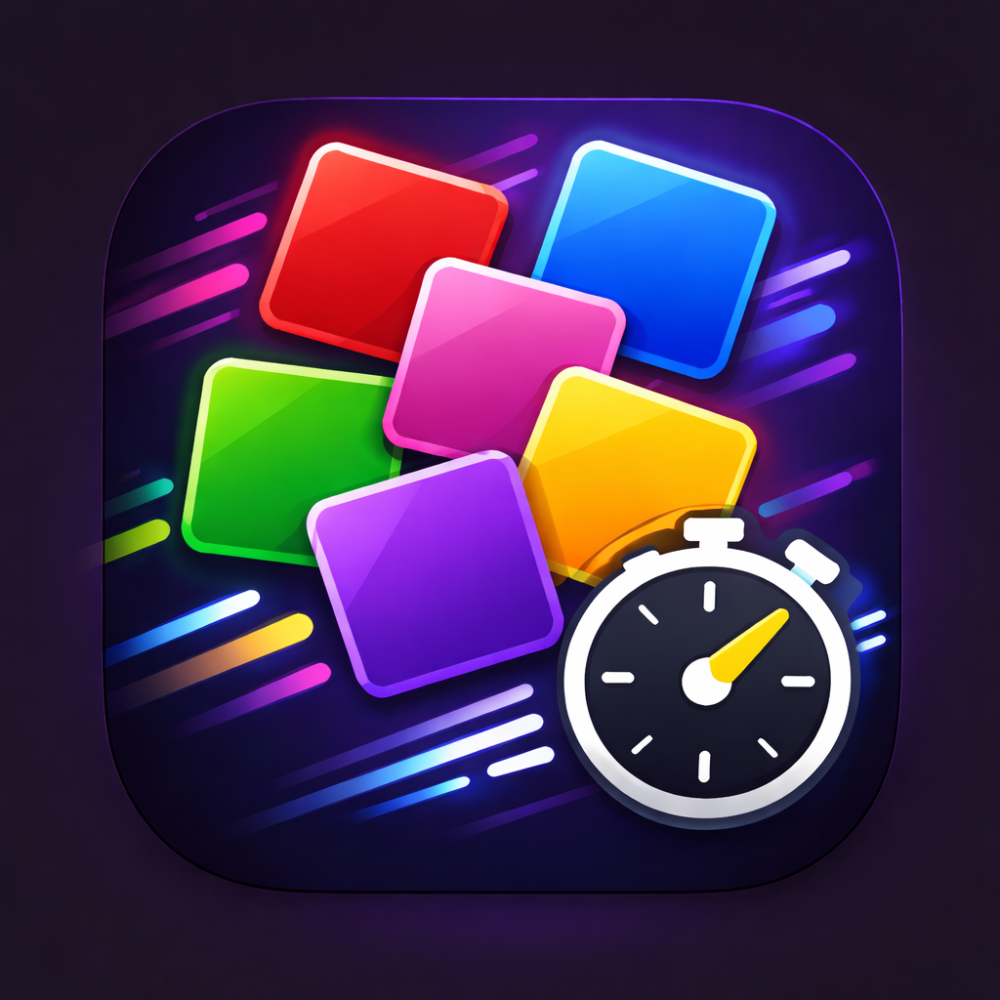
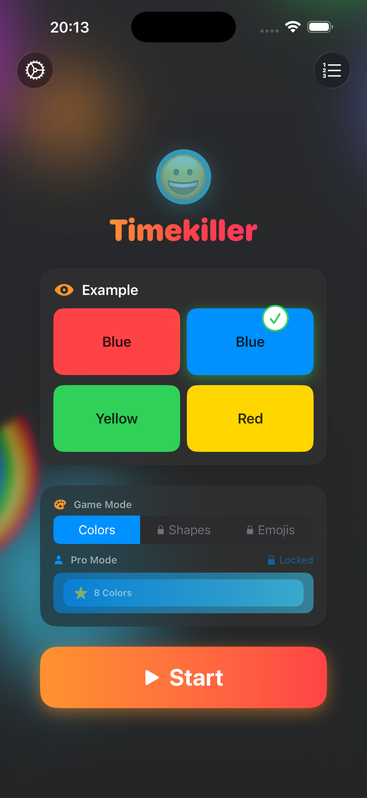
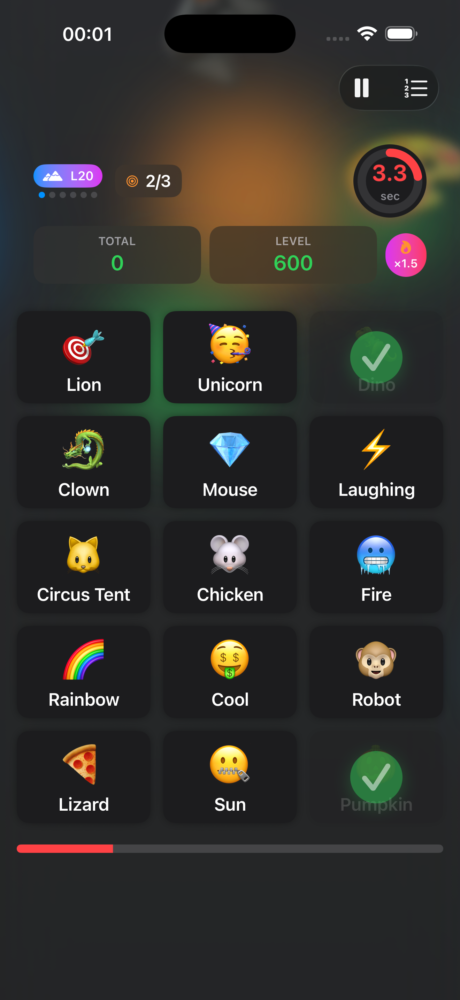
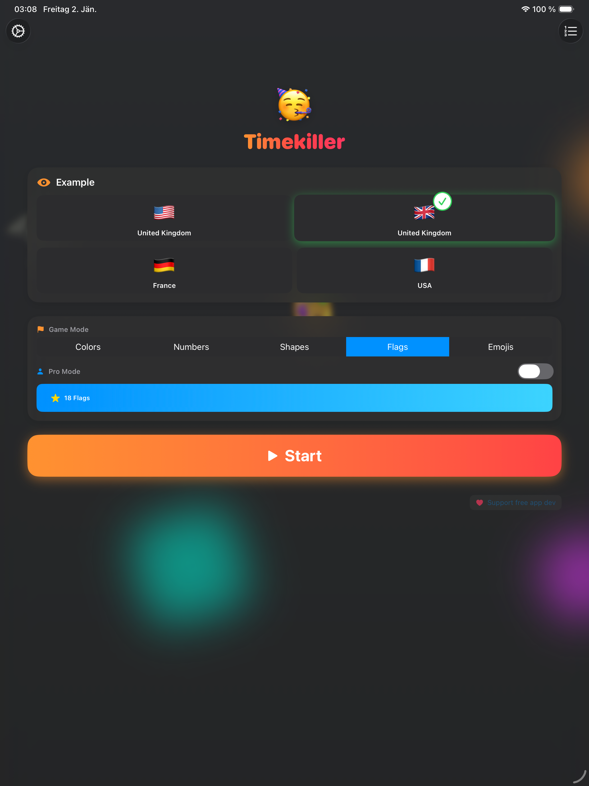
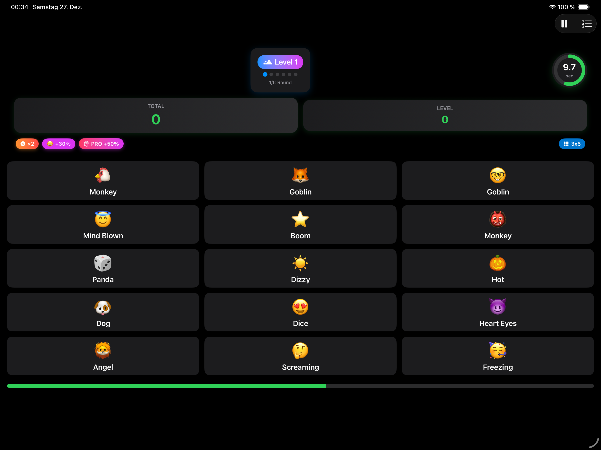
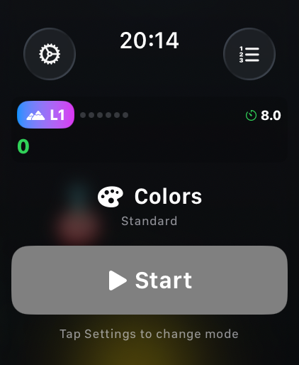
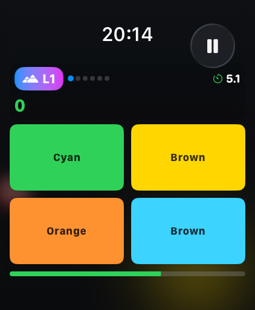

# ⚡️ Timekiller - The Ultimate Reaction Puzzle

**Fast-paced puzzle game that tests your reflexes and brain!**

[English](#english) • [Deutsch](#deutsch)

---

## 📸 Screenshots

#### iPhone

#### iPad

#### Apple Watch

---

## English

### 📖 About

**How fast can you think?** 🧠⚡️

Timekiller is an addictive reaction puzzle game that challenges your brain and reflexes! Your mission: find the tile where the **text label matches the background** before time runs out. 

Sounds simple? Wait until the clock starts ticking! Progress through endless levels, mastering pattern recognition and speed. Start with Colors, unlock Shapes and Emojis, then take on the ultimate Pro Mode challenge. One mistake and you're still in – but the second one ends the game!

Perfect for quick gaming sessions, brain training, or competitive play with friends. No ads, no in-app purchases, no internet required – just pure puzzle fun!

### ✨ Features

- 🎨 **Three Addictive Game Modes**
  - **Colors**: Match color names with backgrounds (8 colors / 16 in Pro mode)
  - **Shapes**: Match shape names with symbols (12 shapes / 24 in Pro mode)
  - **Emojis**: Match emoji names with icons (16 emojis / 64 in Pro mode!)
  
- 📊 **Progressive Grid Sizes**
  - **2×2 Grid**: Levels 1-4 (4 tiles, 8s starting time)
  - **2×4 Grid**: Levels 5-10 (8 tiles, 12s starting time)
  - **3×5 Grid**: Levels 11+ (15 tiles, 15s starting time)

- 🏆 **Progressive Difficulty**
  - Start at Level 1 and see how far you can go!
  - Grid size increases with levels (2×2 → 2×4 → 3×5)
  - Find multiple correct answers per round at higher levels:
    - Levels 1-7: Find 1 correct answer per round
    - Levels 8-15: Find 2 correct answers per round
    - Levels 16-22: Find 3 correct answers per round
    - Levels 23+: Find 4 correct answers per round
  - 6 rounds to complete each level
  - Time stays constant for levels 1-24 (master the basics!)
  - From level 25+: Time reduces by 5% per level – extreme challenge!
  - One mistake allowed per level – second mistake ends the game!

- 🎮 **Player Features**
  - 🏅 18 unlockable achievements across all levels
  - 🔥 Pro mode with expanded content (50% more points!)
  - 📈 Highscore leaderboard (Top 10)
  - 🔊 Sound effects & haptic feedback
  - 🌗 Beautiful Dark & Light themes
  - 🌍 Fully localized in English & German
  - ⌚ Apple Watch companion app included
  - 👤 Multiple player profiles with individual progress tracking

- 🎯 **Smart Scoring System**
  - Base points: 10 per round
  - Level bonus: Current level × 5 points
  - Speed bonus: Seconds remaining × 10 points
  - Pro Mode bonus: 50% more points (1.5× multiplier)
  - Every second counts towards your final score!

### 🎮 How to Play

1. **Choose Your Mode**: Colors, Shapes, or Emojis
2. **Select Pro Mode** (optional): If unlocked, enable for extra challenge and 50% more points
3. **Tap Start**: The timer begins!
4. **Find the Match**: Tap the tile where text = background
5. **Find Multiple Matches**: At higher levels, you'll need to find 2, 3, or 4 correct tiles per round
6. **Beat the Clock**: Answer before time runs out
7. **Complete 6 Rounds**: Finish 6 rounds to advance to the next level
8. **Go Pro**: Unlock Pro mode for the ultimate challenge!

**Grid sizes increase automatically as you progress through levels!** 📈  
**You get one mistake per level - the second mistake ends the game!** ⚡️

### 🏅 Achievement System

Unlock 18 exciting achievements as you progress through the levels! The game features a progressive achievement system that rewards your skills and unlocks new content:

#### 🌱 Early Achievements (Level 5)
- **🎨 Color Cadet**: Reach Level 5 in Colors Standard
- **🔺 Shape Novice**: Reach Level 5 in Shapes Standard (requires Shapes unlock)
- **😊 Emoji Apprentice**: Reach Level 5 in Emojis Standard (requires Emojis unlock)

#### 🔓 Unlocking Achievements (Unlock New Content!)
- **🔷 Polygon Prodigy**: Reach Level 10 in Colors Standard → **Unlocks Shapes Mode!**
- **😎 Smiley Summoner**: Reach Level 20 in Colors Standard → **Unlocks Emoji Mode!**
- **🔥 Ultra Instinct**: Reach Level 30 in any Standard Mode → **Unlocks Pro Mode!**

#### 🌟 Intermediate Achievements (Level 15)
- **🌈 Rainbow Wrangler**: Reach Level 15 in Colors Standard
- **📐 Triangle Tamer**: Reach Level 15 in Shapes Standard
- **🤩 Emoji Enthusiast**: Reach Level 15 in Emojis Standard

#### 💫 Advanced Achievements (Level 25)
- **🎭 Color Virtuoso**: Reach Level 25 in Colors Standard
- **⬢ Shape Master**: Reach Level 25 in Shapes Standard
- **😎 Emoji Expert**: Reach Level 25 in Emojis Standard

#### 🏆 Mastery Achievements (Level 30 Standard)
- **🎨 Chromatic Champion**: Reach Level 30 in Colors Standard
- **🔷 Geometry Genius**: Reach Level 30 in Shapes Standard
- **😄 Emoji Overlord**: Reach Level 30 in Emojis Standard

#### 🔥 Pro Mastery Achievements (Level 30 Pro)
- **🔥🌈 Rainbow Annihilator**: Reach Level 30 in Colors Pro
- **🔥📐 Shape Sorcerer Supreme**: Reach Level 30 in Shapes Pro
- **🔥😈 Emoji Apocalypse**: Reach Level 30 in Emojis Pro

#### 💀 Ultimate Achievement
- **💀 The Unkillable**: Reach Level 30 in ALL 6 modes (3 modes × Standard + Pro) – the ultimate bragging rights!

**Progression Path**: Start with Colors → Unlock Shapes at Level 10 → Unlock Emojis at Level 20 → Unlock Pro Mode at Level 30! Each achievement brings you closer to becoming a true Timekiller champion! 🏆

### 💡 Tips & Strategies

- 🎯 **Focus on the match**, not reading everything – train your pattern recognition!
- ⚡ **Speed matters**, but accuracy is everything! Two wrong taps and you're out.
- 🔰 **Master the early levels** – time stays constant until level 25, so use this to perfect your skills
- 🎓 **Learn each mode** – Each mode (Colors, Shapes, Emojis) plays differently and teaches you new patterns
- 📈 **Strategic progression** – Focus on Colors first to unlock Shapes (level 10), then Emojis (level 20), then Pro (level 30)
- 🔥 **Pro mode** is significantly harder but rewards you with 50% more points
- ⏱️ **Every second counts** – the faster you answer, the higher your score!
- 🎲 **Each emoji game is unique** with different random emojis for endless variety
- 🎯 **Higher levels need multiple answers** – From level 8 onwards, you'll need to find multiple correct tiles per round!
- 📏 **Grid grows with your skill** – Grids automatically expand as you progress through levels
- 💪 **Level 25+** is where the real challenge begins – time starts reducing by 5% per level!

### ❤️ Why You'll Love Timekiller

✅ **Perfect for any moment** – Quick rounds fit perfectly into short breaks  
✅ **Easy to learn, hard to master** – Simple concept with deep challenge  
✅ **Progressive complexity** – Grid sizes and answer requirements grow with your skill  
✅ **Truly competitive** – Compare scores with friends and family  
✅ **No interruptions** – No ads, no paywalls, no spam  
✅ **Works everywhere** – Play on your phone, tablet, or watch  
✅ **Brain training** – Improve your reaction time and pattern recognition  
✅ **Fresh every time** – Random tile arrangements and emoji sets keep it exciting

### 🛠 What You Get

- 📱 **Universal App**: One download, works on iPhone, iPad, and Apple Watch
- 🆓 **Completely Free**: No ads, no in-app purchases, no subscriptions
- 🔒 **Privacy First**: No data collection, no tracking, no internet required
- 🎨 **Beautiful Design**: Modern SwiftUI interface with smooth animations
- 🌍 **Fully Localized**: Available in English and German
- ♿ **Accessible**: Designed to work with VoiceOver and accessibility features
- 💾 **Your Progress, Your Device**: All highscores and settings stay on your device

### 📱 Requirements

- **iPhone or iPad**: iOS 17.0 or later
- **Apple Watch**: watchOS 10.0 or later (companion app)
- Compatible with all screen sizes
- Works offline – no internet connection needed!

### 👤 About the Developer

**Wolfgang Heider** – Independent iOS developer passionate about creating fun, accessible games.

- 💻 GitHub: [@wlfghdr](https://github.com/wlfghdr)
- 📧 Support: Open an issue on GitHub for help or suggestions
- ⭐ **Love the game?** Rate it on the App Store and share with friends!

### 🎯 Coming Soon

We're constantly working to make Timekiller even better! Here's what's on the horizon:

- 🔢 **Additional game modes** (numbers, letters, and more)
- ♾️ **Endless mode** for non-stop action
- 🌐 **Online leaderboards** to compete globally
- 👥 **Multiplayer** challenges with friends

Have a feature request? Let us know on GitHub!

---

## Deutsch

### 📖 Über die App

**Wie schnell kannst du denken?** 🧠⚡️

Timekiller ist ein süchtig machendes Reaktions-Puzzle, das dein Gehirn und deine Reflexe herausfordert! Deine Mission: Finde die Kachel, bei der das **Textlabel mit dem Hintergrund übereinstimmt**, bevor die Zeit abläuft.

Klingt einfach? Warte, bis die Uhr zu ticken beginnt! Schreite durch endlose Level voran und meistere Mustererkennung und Geschwindigkeit. Starte mit Farben, schalte Formen und Emojis frei und stelle dich dann der ultimativen Pro-Modus-Herausforderung. Ein Fehler und du bist noch im Spiel – aber der zweite beendet das Spiel!

Perfekt für kurze Spielsessions, Gehirntraining oder zum Wetteifern mit Freunden. Keine Werbung, keine In-App-Käufe, kein Internet nötig – nur pures Puzzle-Vergnügen!

### ✨ Features

- 🎨 **Drei süchtig machende Spielmodi**
  - **Farben**: Farbnamen mit Hintergründen abgleichen (8 Farben / 16 im Pro-Modus)
  - **Formen**: Formennamen mit Symbolen abgleichen (12 Formen / 24 im Pro-Modus)
  - **Emojis**: Emoji-Namen mit Icons abgleichen (16 Emojis / 64 im Pro-Modus!)
  
- 📊 **Progressive Rastergrößen**
  - **2×2 Grid**: Level 1-4 (4 Kacheln, 8s Startzeit)
  - **2×4 Grid**: Level 5-10 (8 Kacheln, 12s Startzeit)
  - **3×5 Grid**: Level 11+ (15 Kacheln, 15s Startzeit)

- 🏆 **Progressive Schwierigkeit**
  - Starte bei Level 1 und schau, wie weit du kommst!
  - Rastergröße steigt mit den Leveln (2×2 → 2×4 → 3×5)
  - Finde mehrere richtige Antworten pro Runde in höheren Leveln:
    - Level 1-7: Finde 1 richtige Antwort pro Runde
    - Level 8-15: Finde 2 richtige Antworten pro Runde
    - Level 16-22: Finde 3 richtige Antworten pro Runde
    - Level 23+: Finde 4 richtige Antworten pro Runde
  - 6 Runden zum Abschließen jedes Levels
  - Zeit bleibt konstant für Level 1-24 (meistere die Grundlagen!)
  - Ab Level 25+: Zeit reduziert sich um 5% pro Level – extreme Herausforderung!
  - Ein Fehler pro Level erlaubt – der zweite Fehler beendet das Spiel!

- 🎮 **Spieler-Features**
  - 🏅 18 freischaltbare Errungenschaften über alle Level
  - 🔥 Pro-Modus mit erweiterten Inhalten (50% mehr Punkte!)
  - 📈 Highscore-Bestenliste (Top 10)
  - 🔊 Soundeffekte & Haptik-Feedback
  - 🌗 Wunderschöne Dark & Light Themes
  - 🌍 Vollständig lokalisiert in Deutsch & Englisch
  - ⌚ Apple Watch Begleit-App inklusive
  - 👤 Mehrere Spielerprofile mit individueller Fortschrittsverfolgung

- 🎯 **Intelligentes Punktesystem**
  - Basispunkte: 10 pro Runde
  - Level-Bonus: Aktuelles Level × 5 Punkte
  - Geschwindigkeitsbonus: Verbleibende Sekunden × 10 Punkte
  - Pro-Modus-Bonus: 50% mehr Punkte (1,5× Multiplikator)
  - Jede Sekunde zählt für deinen Endscore!

### 🎮 Spielanleitung

1. **Modus wählen**: Farben, Formen oder Emojis
2. **Pro-Modus auswählen** (optional): Falls freigeschaltet, aktiviere für extra Herausforderung und 50% mehr Punkte
3. **Start antippen**: Der Timer beginnt!
4. **Match finden**: Tippe die Kachel an, wo Text = Hintergrund
5. **Mehrere Matches finden**: Bei höheren Leveln musst du 2, 3 oder 4 richtige Kacheln pro Runde finden
6. **Zeit schlagen**: Antworte bevor die Zeit abläuft
7. **6 Runden abschließen**: Beende 6 Runden, um zum nächsten Level aufzusteigen
8. **Pro werden**: Schalte den Pro-Modus für die ultimative Herausforderung frei!

**Rastergrößen steigen automatisch, während du durch die Level fortschreitest!** 📈  
**Du hast einen Fehler pro Level frei - der zweite Fehler beendet das Spiel!** ⚡️

### 🏅 Errungenschaften-System

Schalte 18 spannende Errungenschaften frei, während du durch die Level voranschreitest! Das Spiel bietet ein progressives Errungenschaften-System, das deine Fähigkeiten belohnt und neue Inhalte freischaltet:

#### 🌱 Frühe Errungenschaften (Level 5)
- **🎨 Farb-Kadett**: Erreiche Level 5 in Farben Standard
- **🔺 Form-Anfänger**: Erreiche Level 5 in Formen Standard (benötigt Formen-Freischaltung)
- **😊 Emoji-Lehrling**: Erreiche Level 5 in Emojis Standard (benötigt Emojis-Freischaltung)

#### 🔓 Freischalt-Errungenschaften (Schalten neue Inhalte frei!)
- **🔷 Polygon-Profi**: Erreiche Level 10 in Farben Standard → **Schaltet Formen-Modus frei!**
- **😎 Smiley-Beschwörer**: Erreiche Level 20 in Farben Standard → **Schaltet Emoji-Modus frei!**
- **🔥 Ultra Instinkt**: Erreiche Level 30 in einem Standard-Modus → **Schaltet Pro-Modus frei!**

#### 🌟 Mittlere Errungenschaften (Level 15)
- **🌈 Regenbogen-Bändiger**: Erreiche Level 15 in Farben Standard
- **📐 Dreieck-Zähmer**: Erreiche Level 15 in Formen Standard
- **🤩 Emoji-Enthusiast**: Erreiche Level 15 in Emojis Standard

#### 💫 Fortgeschrittene Errungenschaften (Level 25)
- **🎭 Farb-Virtuose**: Erreiche Level 25 in Farben Standard
- **⬢ Form-Meister**: Erreiche Level 25 in Formen Standard
- **😎 Emoji-Experte**: Erreiche Level 25 in Emojis Standard

#### 🏆 Meisterschafts-Errungenschaften (Level 30 Standard)
- **🎨 Chromatischer Champion**: Erreiche Level 30 in Farben Standard
- **🔷 Geometrie-Genie**: Erreiche Level 30 in Formen Standard
- **😄 Emoji-Oberherr**: Erreiche Level 30 in Emojis Standard

#### 🔥 Pro-Meisterschafts-Errungenschaften (Level 30 Pro)
- **🔥🌈 Regenbogen-Vernichter**: Erreiche Level 30 in Farben Pro
- **🔥📐 Formen-Zauberer Supremo**: Erreiche Level 30 in Formen Pro
- **🔥😈 Emoji-Apokalypse**: Erreiche Level 30 in Emojis Pro

#### 💀 Ultimative Errungenschaft
- **💀 Der Unsterbliche**: Erreiche Level 30 in ALLEN 6 Modi (3 Modi × Standard + Pro) – die ultimativen Bragging Rights!

**Fortschritts-Pfad**: Starte mit Farben → Schalte Formen bei Level 10 frei → Schalte Emojis bei Level 20 frei → Schalte Pro-Modus bei Level 30 frei! Jede Errungenschaft bringt dich näher daran, ein wahrer Timekiller-Champion zu werden! 🏆

### 💡 Tipps & Strategien

- 🎯 **Konzentriere dich auf die Übereinstimmung**, nicht aufs Lesen von allem – trainiere deine Mustererkennung!
- ⚡ **Geschwindigkeit ist wichtig**, aber Genauigkeit ist alles! Zwei falsche Tipps und du bist raus.
- 🔰 **Meistere die frühen Level** – die Zeit bleibt bis Level 25 konstant, also nutze das, um deine Fähigkeiten zu perfektionieren
- 🎓 **Lerne jeden Modus** – Jeder Modus (Farben, Formen, Emojis) spielt sich anders und lehrt dir neue Muster
- 📈 **Strategischer Fortschritt** – Konzentriere dich zuerst auf Farben, um Formen (Level 10), dann Emojis (Level 20), dann Pro (Level 30) freizuschalten
- 🔥 **Pro-Modus** ist deutlich schwerer, belohnt dich aber mit 50% mehr Punkten
- ⏱️ **Jede Sekunde zählt** – je schneller du antwortest, desto höher dein Score!
- 🎲 **Jedes Emoji-Spiel ist einzigartig** mit verschiedenen zufälligen Emojis für endlose Abwechslung
- 🎯 **Höhere Level brauchen mehrere Antworten** – Ab Level 8 musst du mehrere richtige Kacheln pro Runde finden!
- 📏 **Grid wächst mit deinem Können** – Raster erweitern sich automatisch, während du durch die Level fortschreitest
- 💪 **Level 25+** ist, wo die echte Herausforderung beginnt – die Zeit beginnt, sich um 5% pro Level zu reduzieren!

### ❤️ Warum du Timekiller lieben wirst

✅ **Perfekt für jeden Moment** – Schnelle Runden passen perfekt in kurze Pausen  
✅ **Leicht zu lernen, schwer zu meistern** – Einfaches Konzept mit tiefgehender Herausforderung  
✅ **Progressive Komplexität** – Rastergrößen und Anforderungen wachsen mit deinem Können  
✅ **Echt wettbewerbsfähig** – Vergleiche Scores mit Freunden und Familie  
✅ **Keine Unterbrechungen** – Keine Werbung, keine Paywalls, kein Spam  
✅ **Funktioniert überall** – Spiele auf deinem Handy, Tablet oder deiner Uhr  
✅ **Gehirntraining** – Verbessere deine Reaktionszeit und Mustererkennung  
✅ **Immer frisch** – Zufällige Kachel-Anordnungen und Emoji-Sets halten es spannend

### 🛠 Was du bekommst

- 📱 **Universal-App**: Ein Download, funktioniert auf iPhone, iPad und Apple Watch
- 🆓 **Komplett kostenlos**: Keine Werbung, keine In-App-Käufe, keine Abos
- 🔒 **Privatsphäre zuerst**: Keine Datenerfassung, kein Tracking, kein Internet nötig
- 🎨 **Schönes Design**: Moderne SwiftUI-Oberfläche mit flüssigen Animationen
- 🌍 **Vollständig lokalisiert**: Verfügbar in Deutsch und Englisch
- ♿ **Barrierefrei**: Entwickelt für VoiceOver und Bedienungshilfen
- 💾 **Dein Fortschritt, dein Gerät**: Alle Highscores und Einstellungen bleiben auf deinem Gerät

### 📱 Anforderungen

- **iPhone oder iPad**: iOS 17.0 oder neuer
- **Apple Watch**: watchOS 10.0 oder neuer (Begleit-App)
- Kompatibel mit allen Bildschirmgrößen
- Funktioniert offline – keine Internetverbindung nötig!

### 👤 Über den Entwickler

**Wolfgang Heider** – Unabhängiger iOS-Entwickler mit Leidenschaft für unterhaltsame, zugängliche Spiele.

- 💻 GitHub: [@wlfghdr](https://github.com/wlfghdr)
- 📧 Support: Öffne ein Issue auf GitHub für Hilfe oder Vorschläge
- ⭐ **Gefällt dir das Spiel?** Bewerte es im App Store und teile es mit Freunden!

### 🎯 Demnächst

Wir arbeiten ständig daran, Timekiller noch besser zu machen! Das steht auf dem Plan:

- 🔢 **Zusätzliche Spielmodi** (Zahlen, Buchstaben und mehr)
- ♾️ **Endlos-Modus** für Non-Stop-Action
- 🌐 **Online-Bestenlisten** für globalen Wettbewerb
- 👥 **Multiplayer**-Herausforderungen mit Freunden

Hast du einen Feature-Wunsch? Lass es uns auf GitHub wissen!

---

⚡️ **How fast can YOU think?** ⚡️

