# ⚡️ Timekiller

<div align="center">

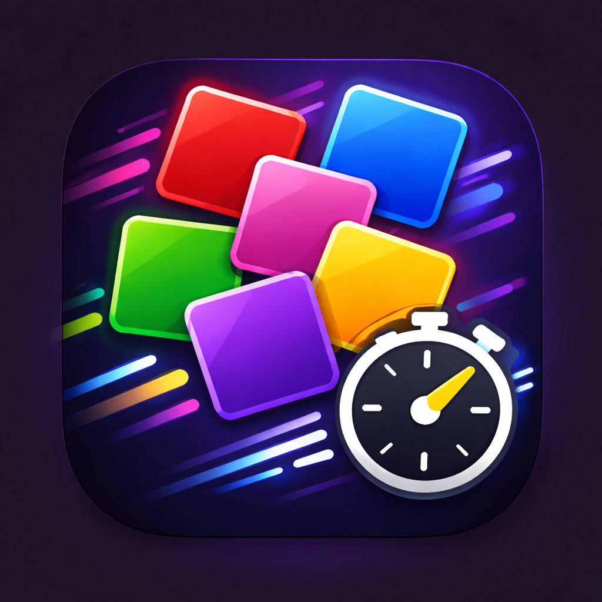

**Fast-paced puzzle game that tests your reflexes and brain!**

[](https://developer.apple.com/ios/)
[](https://developer.apple.com/watchos/)
[](https://swift.org)
[](https://developer.apple.com/xcode/swiftui/)
[](LICENSE)

[](https://apps.apple.com/app/id6757088485)

**iPhone · iPad · Apple Watch**

</div>

---

## 🎬 See It In Action

<div align="center">

https://wlfghdr.github.io/tk-p/Assets/promo.mp4

</div>

---

## 📸 Screenshots

<div align="center">

#### iPhone
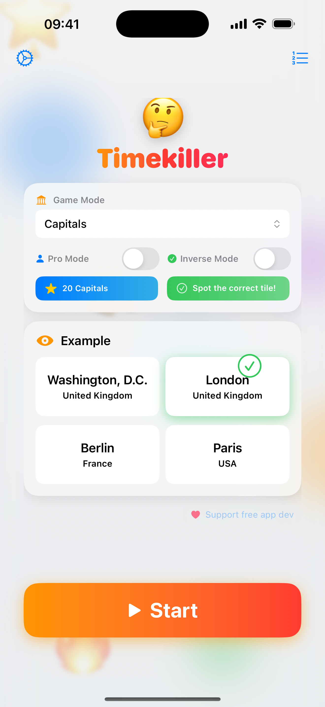
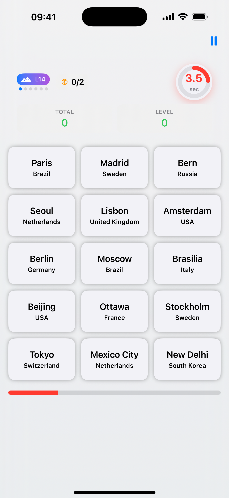
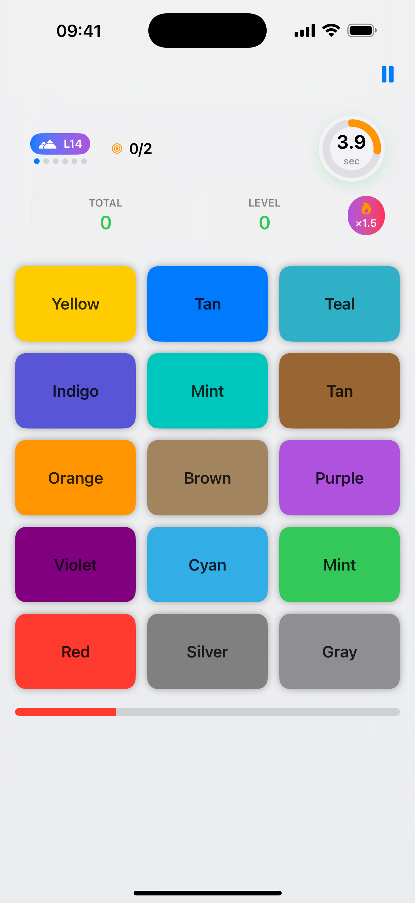

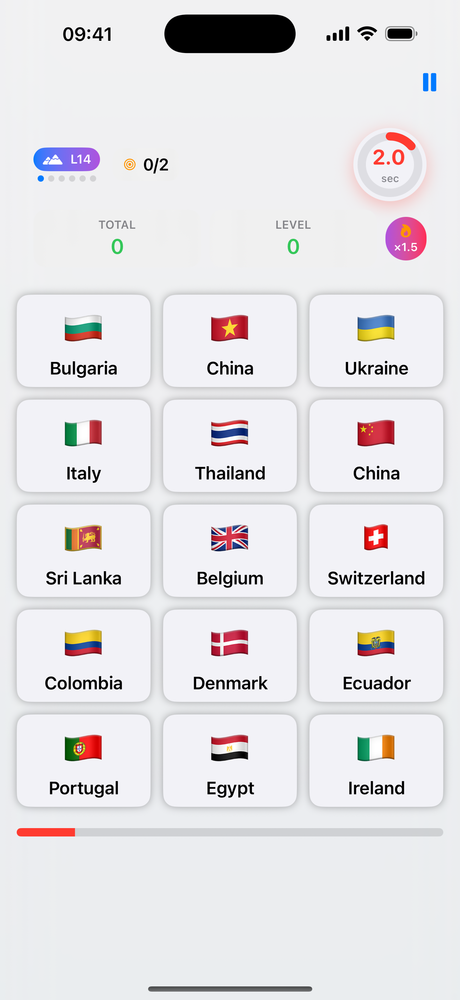
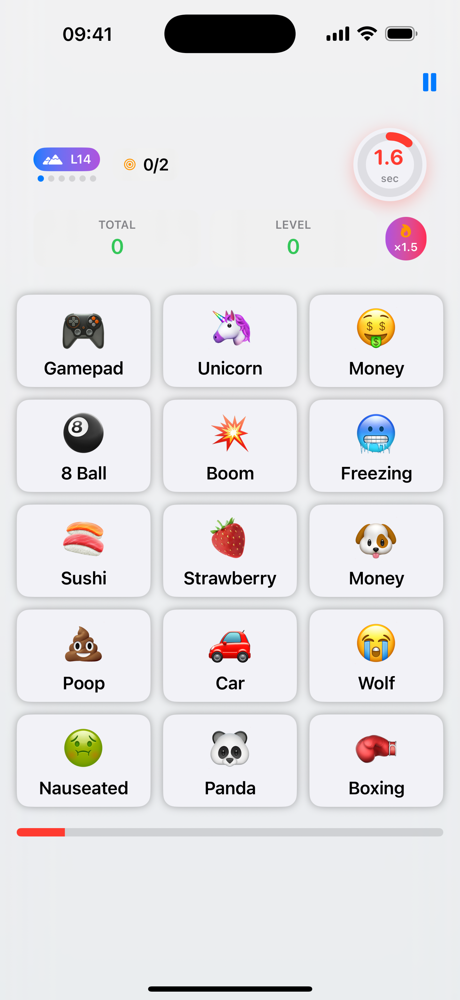

#### iPad
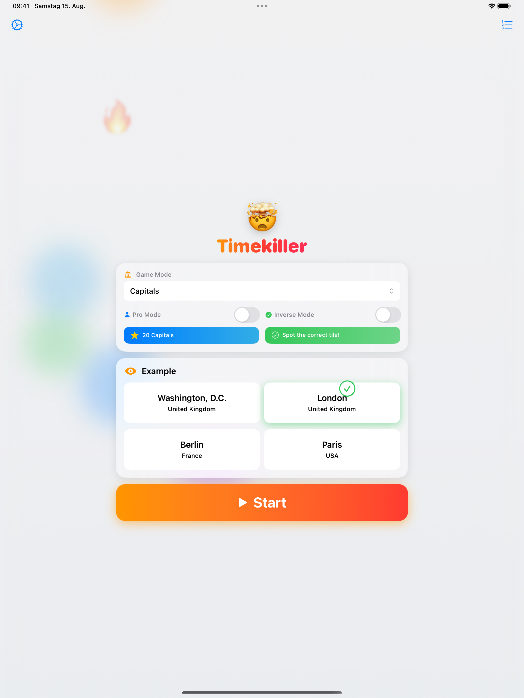
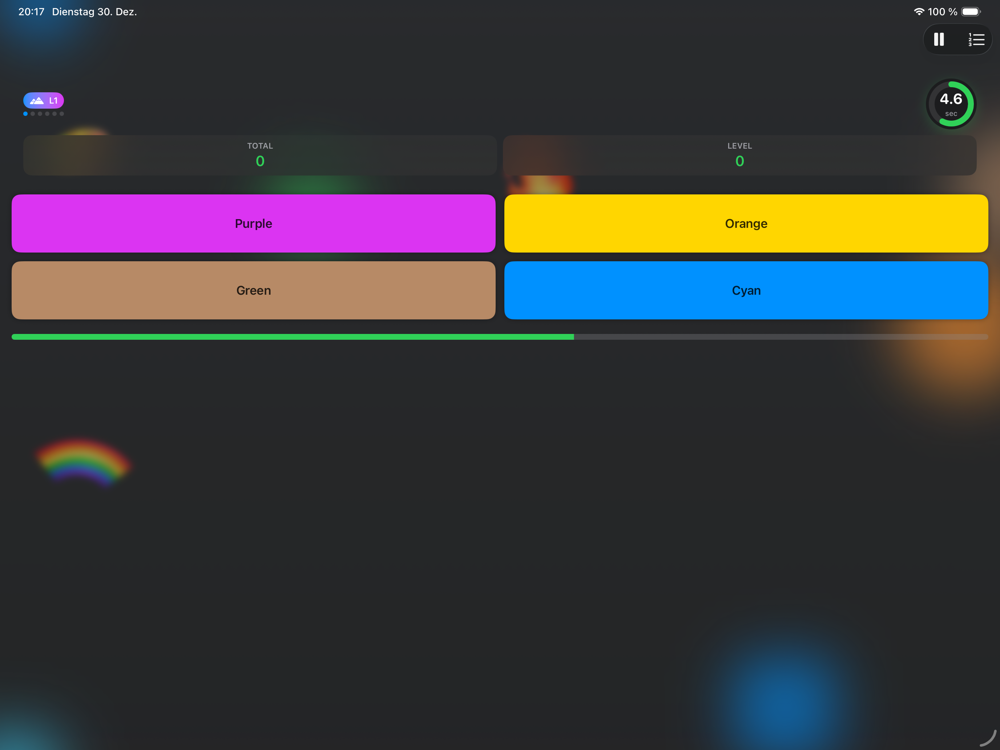
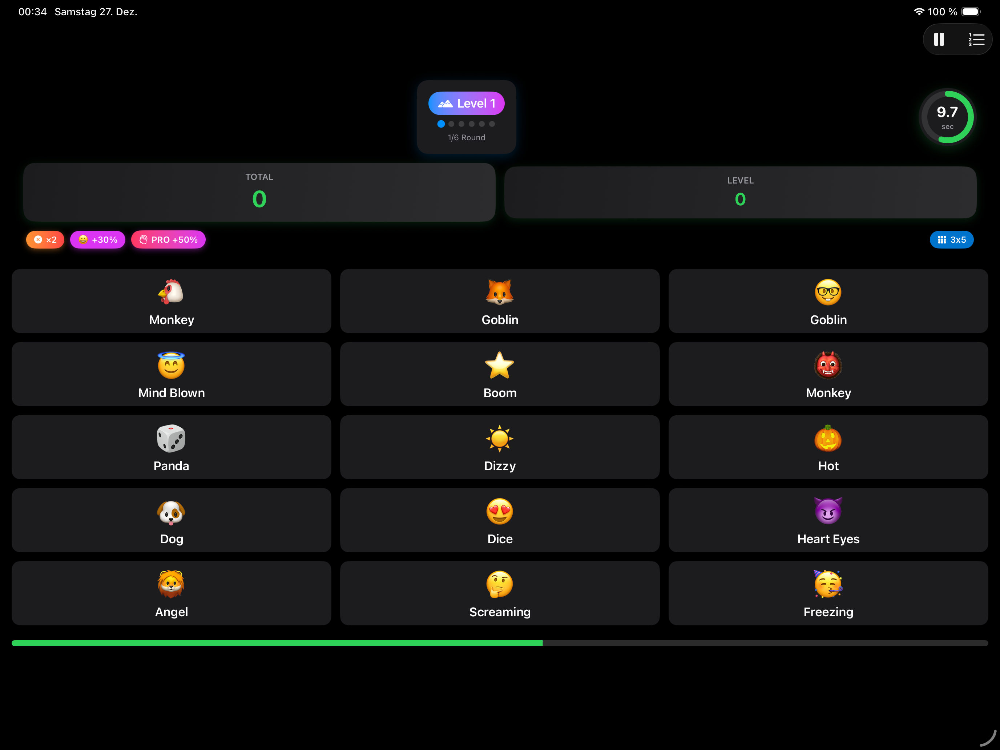

#### Apple Watch
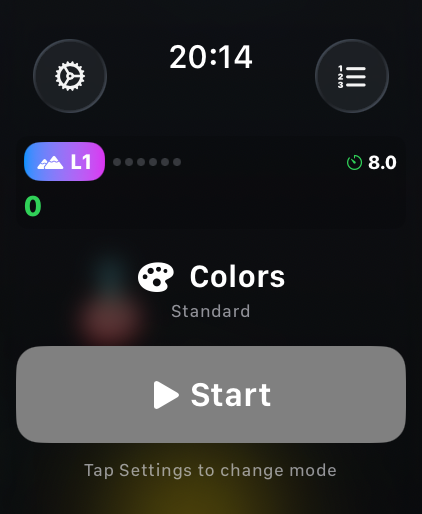
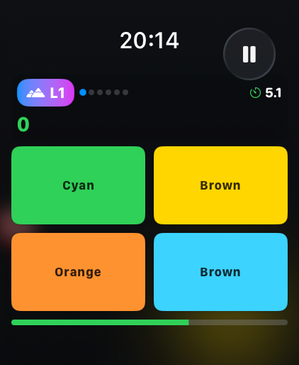

</div>

---

## 📖 About

**How fast can you think?** 🧠⚡️

Timekiller is an addictive reaction puzzle game that challenges your brain and reflexes! Your mission: find the tile where the **text label matches the background** before time runs out. Or flip it around with **Inverse Mode** and hunt for the odd one out!

Sounds simple? Wait until the clock starts ticking! Progress through endless levels, mastering pattern recognition and speed. Start with Colors, unlock Shapes and Emojis, then take on the ultimate Pro Mode challenge. One mistake and you're still in – but the second one ends the game!

Perfect for quick gaming sessions, brain training, or competitive play with friends. No ads, no in-app purchases, no internet required – just pure puzzle fun!

---

## ✨ Features

- 🎨 **6 Game Modes** — Colors, Numbers, Shapes, Flags, Emojis, Capitals
- 🔄 **Inverse Mode** — Find the odd one out instead of the match
- 🔥 **Pro Mode** — Expanded content pools + 50% more points
- 📊 **Progressive Difficulty** — Grids grow from 2×2 to 3×5, time shrinks from level 25+
- 🏆 **26 Achievements** — Including the hidden Bug Hunter 🐛
- 📋 **Game Over Feedback** — See which tiles were the correct answers
- 🗓️ **Weekly Leaderboard** — Resets every Monday, so the top is always in reach
- 🌐 **Game Center** — Global leaderboards & achievements (iOS)
- 👥 **Multiple Profiles** — Everyone gets their own progress
- ⌚ **Apple Watch** — Full game on your wrist
- 🌍 **English & German** — Fully localized
- 💯 **Forever Free** — No ads, no tracking, no paywall

---

## 🌐 Full Details

For the complete experience — gameplay videos, all features, detailed achievements, tips & strategies, and the full German version:

### **👉 [wlfghdr.github.io/tk-p/](https://wlfghdr.github.io/tk-p/)**

---

## 📱 Requirements

- **iPhone or iPad**: iOS 17.0 or later
- **Apple Watch**: watchOS 10.0 or later
- Works offline — no internet needed!

## 🛠 Building

```bash
xcodebuild -project Timekiller.xcodeproj -scheme Timekiller \
  -destination 'platform=iOS Simulator,name=iPhone 17 Pro Max' build
```

Use player name **"Wulf"** for Dev Mode (all modes unlocked, start level selection, auto-solve).

## 👤 About the Developer

**Wolfgang Heider** — Independent iOS developer.

- 💻 GitHub: [@wlfghdr](https://github.com/wlfghdr)
- 📧 Support: [Open an issue](https://github.com/wlfghdr/tk-p/issues)
- ⭐ Love the game? Rate it on the App Store!

## 🎯 Coming Soon

- ♾️ Endless mode
- 👥 Multiplayer
- 🌐 More languages

---

<div align="center">

⚡️ **How fast can YOU think?** ⚡️

</div>
